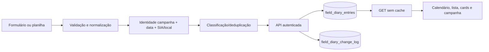

# Metodologia do módulo Diário de Campo

> Documento técnico-funcional auditado no código e nas migrations do repositório em 26/08/2026. As marcações **[FATO IMPLEMENTADO]**, **[INFERÊNCIA]** e **[LACUNA]** distinguem comportamento executável, conclusão sustentada por evidências e ausência de implementação/especificação, respectivamente. Nenhum conteúdo de ambiente ou de produção é reproduzido aqui.

## 1. Propósito, escopo e vocabulário

**[FATO IMPLEMENTADO]** O Diário de Campo registra uma ocorrência de trabalho em uma campanha, num dia e ponto determinados. O modelo inclui identidade da campanha, dia/data, equipe, horário, ponto/SIA, coordenadas, município, atividades, condições visuais da água, ocorrência, encaminhamento, clima, acessibilidade, resumo, estado, autoria, fotos e governança ([`FieldDiaryEntry`](../../src/lib/field-diary.ts#L69-L109)).

**[FATO IMPLEMENTADO]** O código distingue três conceitos:

- `plannedPoints`: pontos de campanha com coordenada `original`, usados como planejamento;
- `selectedPointsForDay`: seleção operacional por campanha/dia, representada pelos pontos efetivamente escolhidos na interface e na planilha;
- `completedFieldEntries`: registros materializados no Diário, que exigem coordenada `effective` **e** evidência operacional no conversor da planilha de campanha ([`campaignPointToFieldDiaryPayload`](../../src/lib/imports/field-spreadsheet-to-diary.ts#L11-L52), [`hasOperationalCollectionEvidence`](../../src/lib/imports/field-spreadsheet-to-diary.ts#L55-L87)).

**[INFERÊNCIA]** “Registro realizado” é a melhor denominação funcional para uma linha persistida, pois o guard de importação rejeita pontos meramente planejados; a base é o predicado explícito de evidência operacional, não um campo chamado `completed`.

**[FATO IMPLEMENTADO]** “Governança” controla a precedência entre planilha e aplicativo: `importado`, `em_revisao`, `consolidado` e `corrigido`; os dois últimos são protegidos contra sobrescrita automática ([tipos e proteção](../../src/lib/field-diary.ts#L111-L129), [constraint](../../supabase/migrations/20260707190000_field_diary_governance.sql#L11-L21)).

## 2. Rotas, navegação e entrypoints

**[FATO IMPLEMENTADO]** A rota canônica é `/dados/diario-de-campo`, cujo page component renderiza `FieldDiaryPageContent` ([page](<../../src/app/(dashboard)/dados/diario-de-campo/page.tsx#L1-L5>)). `/diario-de-campo` e `/campanhas/diario-de-campo` apenas redirecionam para ela ([redirect geral](<../../src/app/(dashboard)/diario-de-campo/page.tsx#L1-L5>), [redirect de campanhas](<../../src/app/(dashboard)/campanhas/diario-de-campo/page.tsx#L1-L5>)).

**[FATO IMPLEMENTADO]** A navegação cadastra “Diário de campo” no grupo “Entrada de dados”, sob o privilégio do grupo `nav.data` ([navigation](../../src/lib/navigation.ts#L85-L115)).

**[FATO IMPLEMENTADO]** A tela de campanhas também embute o mesmo `FieldDiaryPageContent` com `campaignScope` e modo somente leitura, relacionando o diário à campanha selecionada ([integração](../../src/components/campaigns-page-content.tsx#L701-L715)).

## 3. Entrada manual e por planilha

### 3.1 Entrada manual

**[FATO IMPLEMENTADO]** O formulário exige campanha, dia inteiro maior ou igual a 1, data e pelo menos um dado operacional. Para essa validação manual, contam local/SIA/nome ou membros da equipe/coordenadas/município/resumo/tipo ou descrição da ocorrência/notas de follow-up, listas de atividades/água ou fotos ([`validateEntry`](../../src/components/field-diary/helpers.ts#L120-L143)). Horário, amostras/réplicas eDNA e zooplâncton não integram esse predicado.

**[FATO IMPLEMENTADO]** A seleção de município e ponto preenche local e SIA a partir dos pontos da campanha; o matching normaliza texto e SIA ([formulário](../../src/components/field-diary/form.tsx#L48-L105), [opções e matching](../../src/components/field-diary/helpers.ts#L145-L213)).

**[FATO IMPLEMENTADO]** Campos e limites visíveis:

| Grupo | Campo/validação | Unidade, enum ou default |
|---|---|---|
| Identidade | campanha, dia, data | obrigatórios; dia `>= 1` |
| Ponto | município, SIA, local, latitude, longitude | coordenadas textuais, `maxLength=20`; sem unidade exibida ([form](../../src/components/field-diary/form.tsx#L221-L349)) |
| Operação | horário, equipe, amostras/réplicas eDNA, zooplâncton | amostras e zoo `maxLength=120` ([form](../../src/components/field-diary/form.tsx#L298-L315)) |
| Classificação | atividades, condições visuais da água, clima, acessibilidade | enums centrais ([atividades e água](../../src/lib/field-diary.ts#L7-L29), [clima e acesso](../../src/lib/field-diary.ts#L46-L62)) |
| Ocorrência | tem ocorrência, tipo, descrição | tipos enumerados; descrição `maxLength=500` ([enums](../../src/lib/field-diary.ts#L31-L42), [form](../../src/components/field-diary/form.tsx#L396-L457)) |
| Follow-up | `Sim`/`Não`, notas condicionais | notas `maxLength=180` ([form](../../src/components/field-diary/form.tsx#L396-L427)) |
| Resumo | resumo diário | `maxLength=700` ([form](../../src/components/field-diary/form.tsx#L459-L466)) |
| Estado | `Rascunho`/`Enviado`/`Revisado` | default `Rascunho` ([enum](../../src/lib/field-diary.ts#L44-L45), [defaults](../../src/lib/field-diary.ts#L148-L182)) |

**[LACUNA]** A UI e a API não impõem faixa numérica nem unidade formal às coordenadas da entrada manual; elas são strings no modelo e no schema. A planilha de campanha, em contraste, interpreta números como graus decimais e rejeita valores fora dos limites codificados do Paraná ([`parseCoordinate`](../../src/lib/imports/campaigns.ts#L425-L446)).

### 3.2 Entrada por planilha do Diário

**[FATO IMPLEMENTADO]** A interface oferece o modelo `/template-planilha-de-campo.xlsx`, aceita `.xlsx` e `.xlsm`, executa primeiro `preview` e somente aplica após confirmação; o texto afirma que registros ausentes não são apagados automaticamente ([painel de importação](../../src/components/field-diary/import.tsx#L147-L240)). Esse arquivo é gerado com o formato de campanha/aba `Campanhas` ([aba](../../scripts/generate-field-spreadsheet-template.mjs#L65), [asset](../../scripts/generate-field-spreadsheet-template.mjs#L322-L325)).

**[FATO IMPLEMENTADO]** Existe também o asset `/template-diario-de-campo.xlsx`, gerado especificamente para o contrato `Registros` ([aba](../../scripts/generate-field-diary-template.mjs#L50), [asset](../../scripts/generate-field-diary-template.mjs#L261-L265)). **[LACUNA]** O painel atual não oferece link para esse segundo asset; portanto, o template diretamente alinhado às 18 colunas de `Registros` existe no repositório, mas não é descoberto pela UI do Diário.

**[FATO IMPLEMENTADO]** A aba direta `Registros` possui 18 colunas posicionais: campanha, dia, data, responsável, local, SIA, latitude, longitude, município, atividades, água, ocorrência, tipo, descrição, follow-up, notas, resumo e estado ([contrato de colunas](../../src/app/api/field-diary/import/route.ts#L18-L37)). Datas ISO ou brasileiras são aceitas; listas usam `;`; booleano reconhece `sim` ([parsers](../../src/app/api/field-diary/import/route.ts#L76-L105)). Defaults de importação incluem data atual, dia 1, `Rascunho`, follow-up `Não` e campos vazios ([mapeamento](../../src/app/api/field-diary/import/route.ts#L170-L235)).

**[FATO IMPLEMENTADO]** Se a planilha for do formato `Campanhas`, `parseCampaignWorkbook` lê original/effective e metadados; linhas sem código ou qualquer coordenada são ignoradas ([parser](../../src/lib/imports/campaigns.ts#L186-L296)). O conversor só cria payload se houver `effective` e evidência operacional; `original` nunca é fallback ([conversor](../../src/lib/imports/field-spreadsheet-to-diary.ts#L11-L52)).

**[FATO IMPLEMENTADO]** Evidência operacional da importação é atividade de origem, horário, amostra/réplica, zoo, ocorrência, follow-up afirmativo/notas, foto/mídia, resumo ou estado diferente de `Rascunho`; vazios e “Não informado” não contam ([`hasOperationalCollectionEvidence`](../../src/lib/imports/field-spreadsheet-to-diary.ts#L55-L87)). Responsável, acessibilidade e coordenada efetiva isolados não materializam registro.

**[LACUNA]** O modelo baixável não é versionado por número/schema dentro do contrato de API; compatibilidade depende de nomes/posições reconhecidos pelo parser atual.

## 4. Normalização, identidade, deduplicação, consolidação e idempotência

**[FATO IMPLEMENTADO]** A normalização preenche defaults, sanitiza enums/datas/fotos e converte SIA numérico ou variantes para o formato canônico ([`normalizeFieldDiaryEntry`](../../src/lib/field-diary.ts#L316-L371), [normalizadores](../../src/lib/field-diary.ts#L498-L537)).

**[FATO IMPLEMENTADO]** A identidade lógica é campanha + data + chave do ponto; a chave prefere SIA normalizado e cai para o nome do local normalizado. A deduplicação mescla duplicatas, pontua completude e preserva informações mais ricas ([`fieldDiaryEntryKey` e dedupe](../../src/lib/field-diary.ts#L380-L462)).

**[FATO IMPLEMENTADO]** O banco reproduz a identidade com `normalize_field_diary_point_key` e índice único parcial em `(campaign_name, entry_date, point_key)`, permitindo o mesmo ponto/data em campanhas diferentes ([função](../../supabase/migrations/20260707134500_field_diary_numeric_sia_uniqueness.sql#L3-L17), [índice vigente](../../supabase/migrations/20260709110000_field_diary_campaign_aware_uniqueness.sql#L6-L16)).

**[FATO IMPLEMENTADO]** Na importação, `classifyFieldDiaryImport` classifica `novo`, `idêntico`, `aditivo` ou `conflito`. Campos vazios de entrada não apagam valores; registros protegidos conservam o aplicativo, salvo `force`; preliminares podem receber a planilha ([classificação](../../src/lib/imports/conflict-detection.ts#L43-L106)). A equivalência ignora caixa, diacríticos, espaços e ordem/duplicação de arrays ([equivalência](../../src/lib/imports/conflict-detection.ts#L108-L144)).

**[FATO IMPLEMENTADO]** Preview não persiste; apply faz upsert por `id`, registra diferenças e marca ausências sem exclusão automática ([fluxo](../../src/app/api/field-diary/import/route.ts#L238-L319), [`prepareRowsForUpsert`](../../src/app/api/field-diary/import/route.ts#L393-L535)). Reprocessar a mesma identidade produz atualização/idêntico em vez de uma segunda identidade: essa é a idempotência pretendida.

**[FATO IMPLEMENTADO]** Consolidar uma campanha altera apenas registros `importado`/`em_revisao` para `consolidado`; não muda conteúdo operacional ([rota](../../src/app/api/field-diary/consolidate/route.ts#L7-L61)).

## 5. APIs, contratos, Auth, CSRF, permissões e falhas

| Rota | Método | Operação | Permissão |
|---|---|---|---|
| `/api/field-diary` | GET | lista registros, ordenados por data/atualização | sessão ativa ([route](../../src/app/api/field-diary/route.ts#L51-L82)) |
| `/api/field-diary` | POST/PUT | cria/atualiza e audita diferenças | `data.import` ([route](../../src/app/api/field-diary/route.ts#L84-L180)) |
| `/api/field-diary/import` | POST multipart | preview/apply da planilha | `data.import` ([route](../../src/app/api/field-diary/import/route.ts#L127-L169)) |
| `/api/field-diary/consolidate` | POST JSON | consolida campanha | `data.import` ([route](../../src/app/api/field-diary/consolidate/route.ts#L10-L61)) |
| `/api/field-diary/history` | GET | histórico por `entryId` ou campanha, limite 200 | sessão ativa ([route](../../src/app/api/field-diary/history/route.ts#L20-L68)) |
| `/api/photos/upload` | POST multipart | envia foto privada | `data.import` ([route](../../src/app/api/photos/upload/route.ts#L15-L80)) |
| `/api/documents/file` | GET | gera redirect assinado de 10 min | sessão ativa ([route](../../src/app/api/documents/file/route.ts#L9-L50)) |

**[FATO IMPLEMENTADO]** `requireApiSession` exige origem confiável em métodos mutantes, usuário autenticado, perfil ativo e permissão consultada por RPC; a checagem de origem compara `Origin` ao origin configurado ([sessão](../../src/lib/api-auth.ts#L12-L52), [origem](../../src/lib/api-auth.ts#L100-L108)). Isso é proteção CSRF por same-origin, não token CSRF dedicado.

**[FATO IMPLEMENTADO]** Falhas são JSON com status apropriado: 400 entrada inválida — inclusive foto acima de 20 MB —, 401/403 autenticação/permissão, 409 conflito de identidade, 500 erro interno e 503 persistência não configurada em caminhos que exigem nuvem ([write/409](../../src/app/api/field-diary/route.ts#L182-L214), [upload](../../src/app/api/photos/upload/route.ts#L15-L80)). O limite de 12 MB com resposta 413 pertence à importação unificada de campanhas, não a `/api/field-diary/import` ([campanhas](../../src/app/api/imports/campaigns/route.ts#L44-L55)). Respostas de negação desabilitam cache ([`denied`](../../src/lib/api-auth.ts#L115-L116)).

## 6. Schema, constraints, índices, RLS, auditoria e migrations

**[FATO IMPLEMENTADO]** O bootstrap versionado descreve `field_diary_entries` com `id text` PK; campanha/dia/data; equipe; horário; ponto/SIA; amostras/zoo; coordenadas text; município; arrays de atividades/água; ocorrência/follow-up; clima/acesso; resumo/status; autoria/timestamps; `photos jsonb`; governança; ordem; ausência na importação ([schema bootstrap](../../supabase/snippets/setup-yvae-production-complete.sql#L92-L129)).

**[FATO IMPLEMENTADO]** Migrations incrementais adicionam equipe/fotos e índice campanha-dia ([20260707103000](../../supabase/migrations/20260707103000_field_diary_team_photos.sql#L1-L7)), governança e constraint ([20260707190000](../../supabase/migrations/20260707190000_field_diary_governance.sql#L11-L21)), identidade SIA ([20260707134500](../../supabase/migrations/20260707134500_field_diary_numeric_sia_uniqueness.sql#L3-L17)) e unicidade consciente de campanha ([20260709110000](../../supabase/migrations/20260709110000_field_diary_campaign_aware_uniqueness.sql#L6-L16)).

**[FATO IMPLEMENTADO]** `field_diary_change_log` guarda id, entry, campanha, campo, valor anterior/novo, origem, autor e timestamp, com índices por entry e campanha ([migration](../../supabase/migrations/20260708120000_field_diary_change_log.sql#L5-L21)). POST/PUT e importação escrevem diffs; a consulta de histórico os expõe.

**[FATO IMPLEMENTADO]** A migration de corte Auth força RLS, revoga privilégios de `anon`, concede tabela a `authenticated` e cria policies: `data.view` para leitura, `data.import` para insert/update e `data.delete` para delete; o log é somente leitura com `data.view` ([RLS diary](../../supabase/migrations/20260815091000_supabase_auth_rls_cutover.sql#L90-L106), [grants/policies](../../supabase/migrations/20260815091000_supabase_auth_rls_cutover.sql#L135-L255)).

**[LACUNA]** Não há migration de criação inicial de `field_diary_entries` na cadeia `supabase/migrations`; a criação aparece no snippet de bootstrap. Além disso, a migration do log declara `entry_id uuid`, enquanto o bootstrap o declara `text` ([migration](../../supabase/migrations/20260708120000_field_diary_change_log.sql#L5-L15), [bootstrap](../../supabase/snippets/setup-yvae-production-complete.sql#L131-L140)). O estado efetivo depende da sequência de provisionamento; o repositório não contém uma migration corretiva explícita dessa divergência.

## 7. Fotos

**[FATO IMPLEMENTADO]** A captura/seleção aceita PNG/JPEG; antes do envio, o cliente limita o maior lado a 1600 px e reencoda JPEG com qualidade 0,82 ([UI](../../src/components/field-diary/form.tsx#L469-L535), [`resizeImageFile`](../../src/components/field-diary/form.tsx#L561-L590)). A legenda tem `maxLength=180`.

**[FATO IMPLEMENTADO]** O servidor aceita somente JPEG/JPG/PNG, até 20 MB, no bucket privado `photos`, com path sanitizado e `upsert:false`; retorna URL interna `/api/documents/file?bucket=...&path=...` ([upload](../../src/app/api/photos/upload/route.ts#L7-L80)). A URL interna exige sessão, valida bucket/path, rejeita traversal e redireciona para URL assinada de 10 minutos ([file route](../../src/app/api/documents/file/route.ts#L7-L50)).

**[FATO IMPLEMENTADO]** A associação fica no array JSON `photos` do registro, com `id`, URL, legenda, origem, bucket e path ([modelo](../../src/lib/field-diary.ts#L132-L146), [normalização](../../src/lib/field-diary.ts#L465-L496)). A tela exibe fallback textual quando não há fotos ([detalhes](../../src/components/field-diary/view.tsx#L26-L130)).

**[FATO IMPLEMENTADO]** Remover no formulário retira apenas a associação do payload ([handlers](../../src/components/field-diary/form.tsx#L107-L132)). **[LACUNA]** Não há chamada para remover o objeto do Storage nessa ação; portanto, a limpeza física não é garantida pelo módulo.

**[FATO IMPLEMENTADO]** Policies atuais permitem leitura de `photos` a perfil ativo com `campaigns.view`, insert/update com `data.import` e delete com `data.delete` ([storage RLS](../../supabase/migrations/20260815091000_supabase_auth_rls_cutover.sql#L322-L381)).

## 8. Fluxo ponta a ponta

**[FATO IMPLEMENTADO]** Manual: UI valida → `saveFieldDiaryEntry` envia POST/PUT → API normaliza, promove edição manual a `corrigido`, faz upsert e grava diferenças → GET recarrega a fonte ([cliente](../../src/lib/field-diary.ts#L243-L304), [servidor](../../src/app/api/field-diary/route.ts#L92-L180)).

**[FATO IMPLEMENTADO]** Planilha direta: arquivo → preview → parser → dedupe/classificação → confirmação apply → upsert/log → relatório ([cliente](../../src/components/field-diary/import.tsx#L81-L167), [API](../../src/app/api/field-diary/import/route.ts#L238-L365)).

**[FATO IMPLEMENTADO]** Planilha de campanha: parser → `campaignPointToFieldDiaryPayload` fail-closed → classificação → upsert. Um `effective` sem evidência operacional não chega à persistência ([chamador](../../src/app/api/imports/campaigns/route.ts#L130-L172), [guard](../../src/lib/imports/field-spreadsheet-to-diary.ts#L11-L87)).

## 9. Exibição, filtros, edição, exclusão, histórico e exportação

**[FATO IMPLEMENTADO]** A tela oferece métricas, calendário de 42 dias, agrupamento por campanha/data, cards/tabelas do dia e lista completa ([resumos](../../src/components/field-diary/helpers.ts#L33-L79), [calendário](../../src/components/field-diary/calendar.tsx#L57-L298), [page](../../src/components/field-diary-page-content.tsx#L613-L689)).

**[FATO IMPLEMENTADO]** Filtros cobrem data/faixa, dia/faixa, coordenadas, pendência, busca, atividade, água, campanha, local, município, ocorrência/tipo, status, follow-up, responsável e estágio operacional ([predicados](../../src/components/field-diary-page-content.tsx#L297-L393), [controles](../../src/components/field-diary-page-content.tsx#L722-L965)).

**[FATO IMPLEMENTADO]** Detalhes exibem campos e fotos; a edição reutiliza o formulário e grava PUT. O histórico busca por entry e mostra loading/error/empty, limitando visualmente aos 30 primeiros eventos, embora a API consulte até 200 ([detalhes/histórico](../../src/components/field-diary/view.tsx#L26-L192)).

**[LACUNA]** Não existe exclusão individual na UI nem handler DELETE em `/api/field-diary`. Existe exclusão de todos os registros/logs vinculados quando a rota de importações exclui uma campanha com `data.delete` ([DELETE de campanha](../../src/app/api/imports/campaigns/route.ts#L637-L687)); isso não equivale a excluir uma linha do Diário.

**[LACUNA]** Não foi encontrada exportação do Diário (CSV/XLSX/PDF) nos componentes ou rotas do módulo. O único `download` do painel é o modelo de importação ([template](../../src/components/field-diary/import.tsx#L169-L192)).

## 10. Relações com campanha, SIA, resultados, Home/mapas e mídia

**[FATO IMPLEMENTADO]** Campanha e SIA formam a ligação canônica entre registro, pontos e filtros; a tela de campanha passa escopo ao Diário, enquanto `getFieldDiaryCampaignMediaCandidates` lê campanha/SIA/fotos para associar mídia interna aos pontos ([embed](../../src/components/campaigns-page-content.tsx#L701-L715), [candidatos de mídia](../../src/lib/supabase.ts#L210-L253)).

**[FATO IMPLEMENTADO]** O mapa de campanha pode abrir/editar um registro e salva pela mesma função `saveFieldDiaryEntry` ([salvamento do mapa](../../src/components/campaigns-page-content.tsx#L476-L492)). Os resultados e a Home consomem identidade de campanha/ponto por seus próprios agregadores; o Diário não grava resultados laboratoriais.

**[INFERÊNCIA]** A mídia do Diário pode ilustrar campanha/mapa porque o leitor retorna somente identidade canônica e URL interna; a base é a função de candidatos, não uma garantia de que toda foto será escolhida em toda visualização.

## 11. Loading, error, empty, pending, offline e local x nuvem

**[FATO IMPLEMENTADO]** O carregamento inicial chama GET; enquanto carrega há skeleton/estado de loading, e listas/dias sem registros mostram empty state. Erros de salvar/importar/histórico são apresentados por mensagens específicas ([load](../../src/components/field-diary-page-content.tsx#L242-L251), [lista/empty](../../src/components/field-diary-page-content.tsx#L971-L1065), [histórico](../../src/components/field-diary/view.tsx#L132-L192)).

**[FATO IMPLEMENTADO]** A fonte autoritativa fora de localhost é a API: `readFieldDiaryEntries` usa `cache: "no-store"`; cache/browser só é permitido em `localhost`, `127.0.0.1` ou `::1` ([read/cache](../../src/lib/field-diary.ts#L185-L240), [gate local](../../src/lib/browser-persistence.ts#L1-L10)). Assim, cache legado não reidrata produção.

**[FATO IMPLEMENTADO]** Em localhost, falha de API pode cair para localStorage e a gravação local é permitida; fora dele, falha resulta em persistência `none`, sem simular publicação ([save/fallback](../../src/lib/field-diary.ts#L243-L304)). Sidebar e command palette também ignoram o cache fora do ambiente local ([sidebar](../../src/components/sidebar-nav.tsx#L200-L207), [palette](../../src/components/command-palette.tsx#L180-L188)).

**[LACUNA]** Não há fila offline/sincronização posterior, service worker específico ou resolução automática de edições concorrentes offline. “Pending” no módulo refere-se a filtros/conflitos/importação, não a uma outbox durável.

## 12. Testes e invariantes

**[FATO IMPLEMENTADO]** Testes automatizados cobrem:

- conversão válida, identidade canônica e regressão planejado versus operacional, incluindo effective pré-preenchido, reload, novo dia, sessão e não reaparecimento ([suite](../../src/lib/imports/__tests__/field-spreadsheet-to-diary.test.ts#L34-L269));
- classificação novo/idêntico/aditivo/conflito, proteção/force e diff ([suite](../../src/lib/imports/__tests__/conflict-detection.test.ts#L8-L96));
- estágio, resumo, agrupamento, chave, datas/coordenadas e calendário de 42 dias ([suite](../../src/components/field-diary/__tests__/helpers.test.ts#L48-L107));
- cache local aceito apenas em localhost ([suite](../../src/components/__tests__/navigation-browser-persistence.test.ts#L20-L38));
- mídia do Diário com identidade canônica, URL interna e falha fechada ([suite](../../src/lib/__tests__/supabase-field-diary-media.test.ts#L32-L82)).

**[FATO IMPLEMENTADO]** Invariantes principais: `original` não materializa; `effective` isolado não materializa; identidade inclui campanha; ausência na planilha não apaga; protegido não é sobrescrito automaticamente; produção não usa cache local; URL de foto não expõe acesso permanente.

**[LACUNA]** Não foi encontrada suite de integração de rota que execute banco/RLS para todas as APIs do Diário, nem E2E versionado da UI completa de criação → reload → edição → histórico.

## 13. Limitações, riscos e troubleshooting

1. **[LACUNA]** Divergência `field_diary_change_log.entry_id` (`uuid` em migration, `text` no bootstrap): confirmar o schema provisionado antes de uma migration futura; não assumir um tipo pelo TypeScript.
2. **[FATO IMPLEMENTADO]** O formulário manual considera identidade/local/coordenadas como “dado operacional”, enquanto o guard da planilha de campanha é mais restritivo. Essa assimetria é deliberadamente observável no código e deve ser preservada ou alterada com decisão explícita ([manual](../../src/components/field-diary/helpers.ts#L120-L143), [import guard](../../src/lib/imports/field-spreadsheet-to-diary.ts#L55-L87)).
3. **[LACUNA]** Remover uma foto da associação não apaga o objeto; inventário/garbage collection de órfãos não existe aqui.
4. **[FATO IMPLEMENTADO]** Erro 409 indica colisão da identidade campanha/data/ponto; revisar SIA normalizado e local antes de forçar importação ([prepare insert](../../src/app/api/field-diary/route.ts#L182-L214)).
5. **[FATO IMPLEMENTADO]** Erro 503 indica cliente de persistência indisponível; local pode usar fallback browser, produção falha fechada ([GET](../../src/app/api/field-diary/route.ts#L51-L82), [persistence gate](../../src/lib/browser-persistence.ts#L1-L10)).
6. **[FATO IMPLEMENTADO]** Conflitos protegidos devem ser resolvidos no fluxo de pendências; aplicar valor da planilha atualiza somente os campos mapeados ([resolver](../../src/app/api/import-conflicts/route.ts#L105-L174)).
7. **[LACUNA]** Não há exclusão individual nem exportação; não orientar operadores como se esses recursos existissem.

## 14. Matriz final: fato implementado, inferência e lacuna

| Tema | Classificação | Evidência/conclusão |
|---|---|---|
| Registro manual e edição | [FATO IMPLEMENTADO] | formulário + POST/PUT + log |
| Importação `Registros` com preview/apply | [FATO IMPLEMENTADO] | rota e relatório de importação |
| Planejado virar realizado automaticamente | [FATO IMPLEMENTADO] | impedido por effective + evidência operacional |
| Identidade campanha/data/SIA-local | [FATO IMPLEMENTADO] | chave TS e índice SQL |
| Idempotência absoluta sob qualquer concorrência | [INFERÊNCIA] | upsert/índice reduzem duplicação; não há teste concorrente de banco no repo |
| Consolidação/proteção/conflitos | [FATO IMPLEMENTADO] | governança e classificador |
| Histórico completo na UI | [LACUNA] | API limita 200 e UI mostra 30; não há paginação |
| Exclusão individual | [LACUNA] | ausente; apenas exclusão por campanha em outra rota |
| Exportação do Diário | [LACUNA] | ausente; download existente é template |
| Fotos privadas com acesso temporário | [FATO IMPLEMENTADO] | path interno + signed redirect + RLS |
| Remoção física de foto ao desassociar | [LACUNA] | nenhuma operação Storage delete no formulário |
| Operação offline sincronizável | [LACUNA] | somente fallback local sem outbox |
| Cache de produção como fonte | [FATO IMPLEMENTADO] | explicitamente bloqueado fora de localhost |
| Relação com campanha/mapa por SIA | [FATO IMPLEMENTADO] | embed e candidatos de mídia |
| Relação direta com resultados laboratoriais | [LACUNA] | não há gravação/foreign key direta no módulo |
| Schema inicial reproduzível só por migrations | [LACUNA] | criação está em snippet, não na cadeia de migrations |

## Apêndice A — mapa completo de produtores e mutadores

| Arquivo/símbolo | Rota/operação | Origem | Efeito |
|---|---|---|---|
| [`writeEntry`](../../src/app/api/field-diary/route.ts#L92-L180) | POST/PUT `/api/field-diary` | formulário e mapa | upsert de uma entrada + log |
| [`POST`](../../src/app/api/field-diary/import/route.ts#L127-L319) | POST `/api/field-diary/import` | planilha `Registros` ou `Campanhas` | preview ou upsert em lote + log |
| [`applyUnifiedFieldImport`](../../src/app/api/imports/campaigns/route.ts#L130-L235) | POST `/api/imports/campaigns` | planilha de campanha | guard operacional, classificação e upsert |
| [`applySheetValuesToDiary`](../../src/app/api/import-conflicts/route.ts#L105-L174) | resolução de pendências | escolha “planilha” | update delimitado de campos conflitantes |
| [`POST consolidate`](../../src/app/api/field-diary/consolidate/route.ts#L10-L61) | POST `/api/field-diary/consolidate` | ação de governança | update somente de governance status |
| [`DELETE campaigns`](../../src/app/api/imports/campaigns/route.ts#L637-L687) | DELETE `/api/imports/campaigns` | exclusão administrativa da campanha | delete de logs, entradas e import da campanha |

**[FATO IMPLEMENTADO]** Nenhum outro acesso `.from("field_diary_entries")` encontrado no código de aplicação grava linhas: os demais são leitura/preparação de importação ou candidatos de mídia. Esta afirmação decorre de busca transversal no snapshot documentado.

## Apêndice B — referência operacional de defaults

**[FATO IMPLEMENTADO]** O objeto vazio central usa arrays vazios, `hasOccurrence=false`, `requiresFollowUp="Não"`, `status="Rascunho"` e textos vazios; ele não define `governanceStatus` ([`createEmptyFieldDiaryPayload`](../../src/lib/field-diary.ts#L152-L182)). A promoção para `corrigido` ocorre no `writeEntry` de gravação manual ([servidor](../../src/app/api/field-diary/route.ts#L92-L180)). “Coleta realizada” não é injetada pelo conversor atual: atividades vêm da origem e vazios permanecem vazios ([conversor](../../src/lib/imports/field-spreadsheet-to-diary.ts#L22-L52)).
